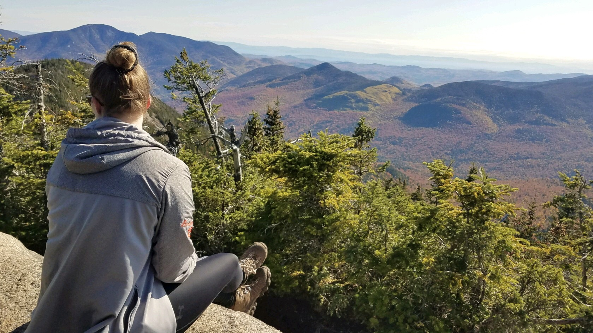

My name is Sarah and I am currently a Research and Development Engineer at Kitware. Previously, I received my CS and Math BS degrees and my CS MS degree at the University of Massachusetts, Amherst. 

During my time at UMass, I have worked in the Laboratory for Advanced Software Engineering Research ([LASER](http://laser.cs.umass.edu/)) with Prof. Yuriy Brun and the Autonomous Learning Lab ([ALL](http://www-anw.cs.umass.edu/)) with Prof. Phil Thomas. Most of this work has concerned fairness in machine learning, an example of which can be found in our [2019 NeurIPS paper](https://papers.nips.cc/paper/9630-offline-contextual-bandits-with-high-probability-fairness-guarantees) on fairness with contextual bandits. If you'd like to learn more about the fairness work going on at UMass, head on over to [aisafety.cs.umass.edu](https://aisafety.cs.umass.edu/about.html).

In December 2019, I had the chance to attend NeurIPS in Vancouver, Canada to present our paper. Check it out [here](https://women.acm.org/scholars/acm-w-scholars/sarah-brockman/)!

Over the past few years I've also had the opportunity to intern at some great places. Check out my [resume](../files/resume_2020.pdf) to learn more about these experiences. I am most interested in the combination of machine learning and software engineering, to create efficient and practical tools that leverage the benefits of ML.

On the non-academic side of things, I enjoy hiking (currently working towards hiking all 46 high peaks in the Adirondacks), reading, playing video games, travelling, and learning about history. I speak some French, and enjoy learning the language in my free time.

Summit of Upper Wolfjaw, ADK High Peaks, New York
